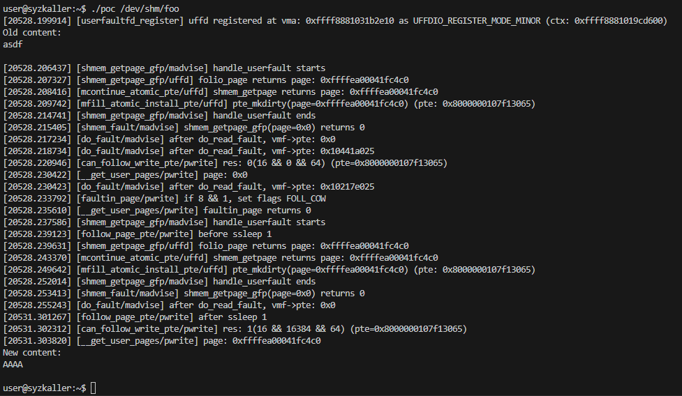

# CVE-2022-2590, Dirty COW restricted to shmem

linux kernel version: Linux/x86 6.0.0-rc1 (commit 37887783b3fef877bf34b8992c9199864da4afcb)

## Introduction:

this vulnerability allows the attacker to write arbitrary content to read-only shared memory page by satisfying the function `can_follow_write_pte`, which checks FOLL_FORCE, FOLL_COW, and pte_dirty, using UFFDIO_CONTINUE.

## Analysis:

```c
/*
 * FOLL_FORCE can write to even unwritable pte's, but only
 * after we've gone through a COW cycle and they are dirty.
 */
static inline bool can_follow_write_pte(pte_t pte, unsigned int flags)
{
	return pte_write(pte) ||
		((flags & FOLL_FORCE) && (flags & FOLL_COW) && pte_dirty(pte));
}
```

The function above determines whether a pte is writable. 

The pte is considered writable, if it meets one of the following conditions:

1. The pte's flags include writable flag.
2. The flags variable contains the FOLL_FORCE and FOLL_COW flags, and the pte's flags include dirty flag.

To satisfy condition 2, the following three flags need to be set:

1. FOLL_FORCE

   ```c
   static ssize_t mem_rw(struct file *file, char __user *buf,
   			size_t count, loff_t *ppos, int write)
   {
   	...

   	flags = FOLL_FORCE | (write ? FOLL_WRITE : 0);

   	while (count > 0) {
   		size_t this_len = min_t(size_t, count, PAGE_SIZE);

   		if (write && copy_from_user(page, buf, this_len)) {
   			copied = -EFAULT;
   			break;
   		}

   		this_len = access_remote_vm(mm, addr, page, this_len, flags); // __get_user_pages with FOLL_FORCE on
   		if (!this_len) {
   			if (!copied)
   				copied = -EIO;
   			break;
   		}

   		...
   }
   ```

   The above function performs read/write operations on /proc/\<pid\>/mem. 
   
   By using this function, you can reach the `__get_user_pages` function with the FOLL_FORCE flag on. 
   
   Although FOLL_FORCE is meant to be used in ptrace, its necessity has been proved in the following commit: https://github.com/torvalds/linux/commit/f511c0b17b081562dca8ac5061dfa86db4c66cc2

2. FOLL_COW

    ```c
    /*
    * mmap_lock must be held on entry.  If @locked != NULL and *@flags
    * does not include FOLL_NOWAIT, the mmap_lock may be released.  If it
    * is, *@locked will be set to 0 and -EBUSY returned.
    */
   static int faultin_page(struct vm_area_struct *vma,
   		unsigned long address, unsigned int *flags, bool unshare,
   		int *locked)
   {
      ...

      /*
      * The VM_FAULT_WRITE bit tells us that do_wp_page has broken COW when
      * necessary, even if maybe_mkwrite decided not to set pte_write. We
      * can thus safely do subsequent page lookups as if they were reads.
      * But only do so when looping for pte_write is futile: in some cases
      * userspace may also be wanting to write to the gotten user page,
      * which a read fault here might prevent (a readonly page might get
      * reCOWed by userspace write).
      */
      if ((ret & VM_FAULT_WRITE) && !(vma->vm_flags & VM_WRITE))
        *flags |= FOLL_COW;
      return 0;
   }
    ```

    OR operation with FOLL_COW in the `faultin_page` function can be used, which is a part of the patch for the Dirty COW.

    ```c
    static long __get_user_pages(struct mm_struct *mm,
     		unsigned long start, unsigned long nr_pages,
     		unsigned int gup_flags, struct page **pages,
     		struct vm_area_struct **vmas, int *locked)
     {
     	...
     retry:
     		/*
     		 * If we have a pending SIGKILL, don't keep faulting pages and
     		 * potentially allocating memory.
     		 */
     		if (fatal_signal_pending(current)) {
     			ret = -EINTR;
     			goto out;
     		}
     		cond_resched();

     		page = follow_page_mask(vma, start, foll_flags, &ctx); // can_follow_write_pte
     		if (!page || PTR_ERR(page) == -EMLINK) {
     			ret = faultin_page(vma, start, &foll_flags,
     					   PTR_ERR(page) == -EMLINK, locked); // flags |= FOLL_COW
     			switch (ret) {
     			case 0:
     				goto retry; // try follow page again
     			case -EBUSY:
     			case -EAGAIN:
     				ret = 0;
     				fallthrough;
     			case -EFAULT:
     			case -ENOMEM:
     			case -EHWPOISON:
     				goto out;
     			}
     			BUG();
     		} else if (PTR_ERR(page) == -EEXIST) {
        ...
     }
    ```

    In order to reach the `can_follow_write_pte` function with the FOLL_COW flag on, you need to call the `faultin_page` function within the `__get_user_pages` function, redirect to the `retry` label, and call the `faultin_page` function again.

3. pte_dirty

    This condition can be satisfied due to the following commit: https://github.com/torvalds/linux/commit/9ae0f87d009ca6c4aab2882641ddfc319727e3db

    ```c
    /*
    * Install PTEs, to map dst_addr (within dst_vma) to page.
    *
    * This function handles both MCOPY_ATOMIC_NORMAL and _CONTINUE for both shmem
    * and anon, and for both shared and private VMAs.
    */
   int mfill_atomic_install_pte(struct mm_struct *dst_mm, pmd_t *dst_pmd,
   			     struct vm_area_struct *dst_vma,
   			     unsigned long dst_addr, struct page *page,
   			     bool newly_allocated, bool wp_copy)
   {
     	...

     	_dst_pte = mk_pte(page, dst_vma->vm_page_prot);
     	_dst_pte = pte_mkdirty(_dst_pte); // set pte dirty unconditionally
     	if (page_in_cache && !vm_shared)
     		writable = false;

     	...
   }
    ```

    Due to the above patch, it is possible to install a pte for the read-only shared memory page in a dirty state unconditionally.

&nbsp;

If those three flags are satisfied, the `can_follow_write_pte` function will return true.

```c
static struct page *follow_page_pte(struct vm_area_struct *vma,
		unsigned long address, pmd_t *pmd, unsigned int flags,
		struct dev_pagemap **pgmap)
{
	...
    
	// true && !true == false
	if ((flags & FOLL_WRITE) && !can_follow_write_pte(pte, flags)) {
		pte_unmap_unlock(ptep, ptl);
		return NULL;
	}

	page = vm_normal_page(vma, address, pte); // get read-only shared memory page

	...

out:
	pte_unmap_unlock(ptep, ptl);
	return page;
no_page:
	pte_unmap_unlock(ptep, ptl);
	if (!pte_none(pte))
		return NULL;
	return no_page_table(vma, flags);
}
```

The function `follow_page_pte` returns the read-only shared memory page.

## Race Scenario:

The following is the race scenario proved by the PoC, which will be introduced later.

| madvise and read | UFFDIO_CONTINUE ioctl | pwrite |
| --- | --- | --- |
| madvise // zap the page |  |  |
| shmem_fault // read fault |  |  |
| handle_userfault |  |  |
|  | userfaultfd_continue |  |
|  | mcontinue_atomic_pte |  |
|  | ret = shmem_getpage(inode, pgoff, &page, SGP_NOALLOC); // get page |  |
|  | mfill_atomic_install_pte |  |
|  | _dst_pte = pte_mkdirty(_dst_pte); // make pte dirty |  |
|  | set_pte_at(dst_mm, dst_addr, dst_pte, _dst_pte); // install pte | mem_rw |
|  |  | access_remote_vm // with FOLL_FORCE |
|  |  | __get_user_pages |
|  |  | can_follow_write_pte // no FOLL_COW, return 0 |
|  |  | faultin_page |
|  |  | flags |= FOLL_COW |
|  |  | retry: |
|  |  | follow_page_pte |
| madvise // zap the page |  |  |
| shmem_fault // read fault |  |  |
| handle_userfault |  |  |
|  | userfaultfd_continue |  |
|  | mcontinue_atomic_pte |  |
|  | ret = shmem_getpage(inode, pgoff, &page, SGP_NOALLOC); // get page |  |
|  | mfill_atomic_install_pte |  |
|  | _dst_pte = pte_mkdirty(_dst_pte); // make pte dirty |  |
|  | set_pte_at(dst_mm, dst_addr, dst_pte, _dst_pte); // install pte |  |
|  |  | can_follow_write_pte // return 1 |
|  |  | copy_to_user(buf, page, this_len) // write content to read-only page |

The madvise and read routines are executed twice; the first execution induces a `retry` of `__get_user_pages`, and the second execution guides the `follow_page_pte` to return the page pointed by pte that has been made dirty by `mfill_atomic_install_pte`.

## PoC and Patch:

https://www.openwall.com/lists/oss-security/2022/08/15/1

You can check David Hildenbrand's reproducer at the link above. 

However, since the reproducer makes it difficult to recognize the exact race scenario, I modified the reproducer to prefer a more linear execution, and accordingly, modified the Linux kernel source code as well.

.config:

```text
...
CONFIG_USERFAULTFD=y
CONFIG_HAVE_ARCH_USERFAULTFD_WP=y
CONFIG_HAVE_ARCH_USERFAULTFD_MINOR=y
...
```

PoC: (poc.c)

Patch: (poc_deayzl.patch)

For testing, the following preliminary steps must be done. (The instructions in david's reproducer says the file path is /tmp/foo. But tmpfs is not shared memory in the current version, so the userfaultfd register fails)

```sh
sudo -s
echo "asdf" > /dev/shm/foo
chmod 0404 /dev/shm/foo
exit
```

After running the PoC, you will see the following screen.



## References:

commit: https://github.com/torvalds/linux/commit/5535be3099717646781ce1540cf725965d680e7b

lore.kernel patch v1: https://lore.kernel.org/linux-mm/20220808073232.8808-1-david@redhat.com/#r

lore.kernel patch v2: https://lore.kernel.org/all/20220809205640.70916-1-david@redhat.com/T/#u

openwall: https://www.openwall.com/lists/oss-security/2022/08/08/1

openwall2: https://lists.openwall.net/linux-kernel/2022/08/08/418

